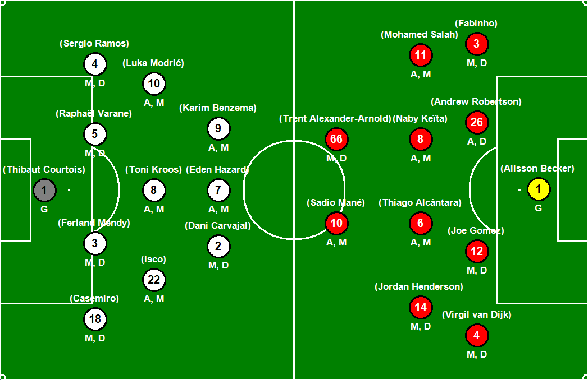
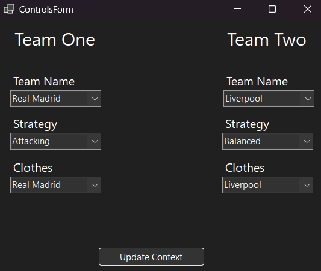

# Soccer Strategy Simulator

This project is a C# Windows Forms application that simulates soccer strategy planning using four design patterns. The application allows users to configure two teams, set their strategies, and visualize player positions on a soccer field.

## Implemented Design Patterns

### 1. Observer Pattern

The observer pattern is used to synchronize changes between two forms:

* **Controls Form** : Allows users to configure team settings.
* **Game Form** : Displays the soccer field and updates automatically when team settings change.

Whenever the user updates the team settings in the  **Controls Form** , the **Game Form** receives notifications and updates the display accordingly.

### 2. Strategy Pattern

Each team can adopt a different strategy from a predefined set, allowing dynamic gameplay configurations. Available strategies include:

* Attacking
* Defensive
* Balanced

Each strategy influences the way players are positioned and behave on the field.

### 3. Decorator Pattern

Players can take on multiple roles at the same time. Instead of limiting a player to a single role, the decorator pattern enables dynamic role assignments, such as:

* A midfielder who is also a playmaker
* A defender who also supports attacks

This allows for more realistic soccer simulations.

### 4. Builder Pattern

The builder pattern is used to construct the components of each team in steps before finalizing the team setup. The builder ensures that every team has:

* A goalkeeper
* Defenders
* Midfielders
* Attackers

This structured approach helps in creating teams systematically.

## Screenshots

### Controls Form

### Playground Form

## How to Run

1. Clone the repository.
2. Open the solution in Visual Studio.
3. Build and run the application.
4. Configure team settings in the  **Controls Form** .
5. Observe the updates in the  **Game Form** .

## Technologies Used

* C# Windows Forms
* Object-Oriented Programming
* Design Patterns (Observer, Strategy, Decorator, Builder)
